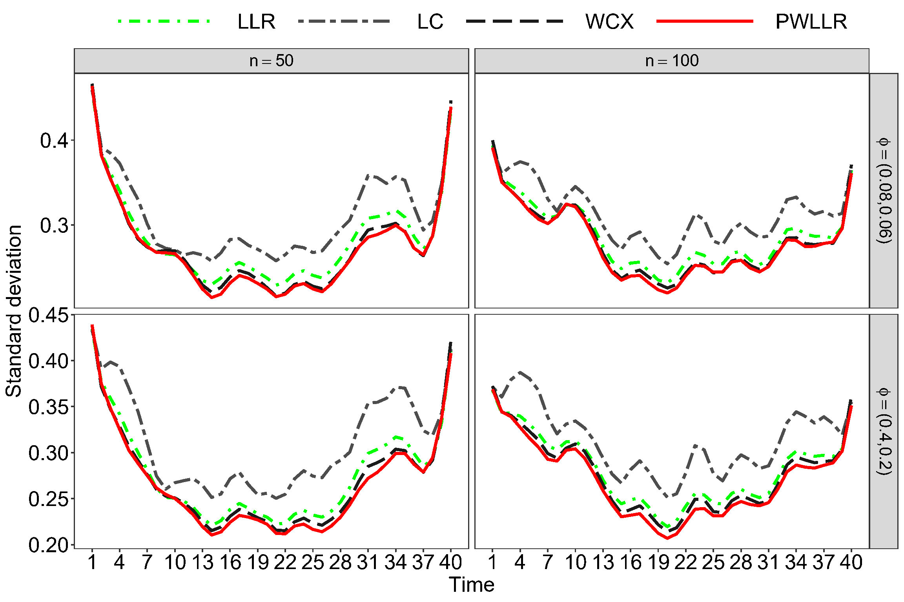

# An Efficient Estimation Method for Semiparametric Models of Spatial-Temporal Data

In this work, the regression problem of spatiotemporal data is studied under the framework of the semiparametric model. A new kernel estimator for the spatiotemporally correlated data is proposed to improve estimation efficiency of existing kernel methods such as the local linear regression.

## An simulation result
<figure id="Figure1">
    

  
  

  <figcaption
  <strong>Figure 1:</strong> The trajectory of the standard deviation of the function g(t) over the sampling time points. (1) LLR (Liu et al., 2021). (2) LC (Lin and Carroll, 2001b). (3) WCX (Wang et al. 2005). (4) The proposed PWLLR.
</figcaption>
</figure>

