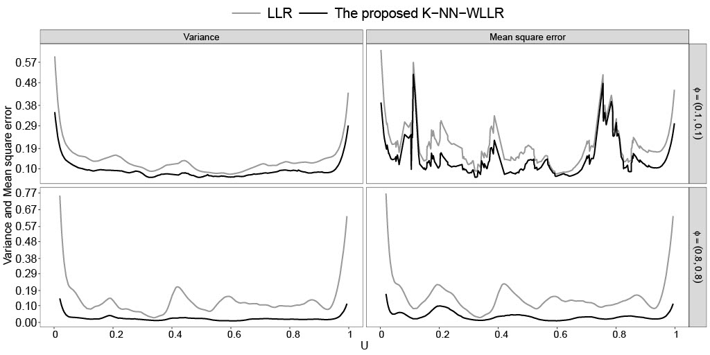

# Robust and efficient estimation of semiparametric models for complex spatiotemporal dependent data

Spatiotemporal semiparametric models are increasingly valued for their flexibility and interpretability, yet inference and computation remain methodologically challenging due to complex dependence structures. In this work, we propose a novel profile-kernel approach for estimating these models. This approach flexibly learns the dependence structure without assuming stationarity, by leveraging machine learning techniques. Beyond existing methods, the proposed approach properly accounts for spatiotemporal dependence in estimating both the nonparametric and parametric components of the mean function. Under a spatiotemporal increasing-domain asymptotic framework, we show that the proposed method reduces the bias and improves the efficiency of the existing kernel estimators. It also ensures consistency and achieves optimal efficiency for the parametric component. This study provides the first large-sample evidence combining spatiotemporal semiparametric models with machine learning techniques for irregular spatial data. Empirical results from both simulated and real-world air pollution data further demonstrate that our methodology provides an efficient, robust, and scalable framework for inference and prediction in complex spatiotemporal data.

## A simulation result
<figure id="Figure1">
    

  
  

  <figcaption
  <strong>Figure 1:</strong> Pointwise Variance and Mean Square Error of the estimations for g(u). (1) LLR (Liu et al., 2021, JMVA) and the proposed method.
</figcaption>
</figure>

