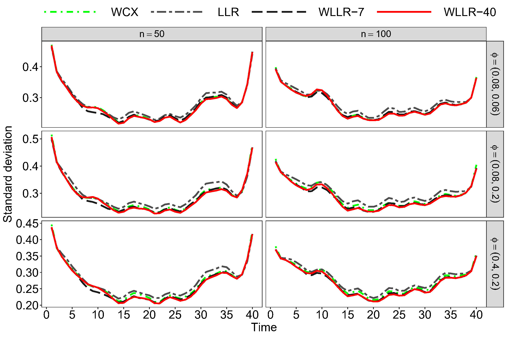

# An Efficient Estimation Method for Semiparametric Models of Spatial-Temporal Data

In this work, the regression problem of spatiotemporal data is studied under the framework of the semiparametric model. A new kernel estimator for the spatiotemporally correlated data is proposed to estimate nonpatametric functions, and we show the new method can improve estimation efficiency of nonpatametric functions from existing kernel methods such as the local linear regression.

## A simulation result
<figure id="Figure1">
    

  
  

  <figcaption
  <strong>Figure 1:</strong> The trajectory of the standard deviation of the function g(t) over the sampling time points. (1) WCX (Wang et al. 2005, JASA). (2) LLR (Liu et al., 2021, JMVA). (3) The proposed PWLLR-7. (4) The proposed PWLLR-40.
</figcaption>
</figure>

